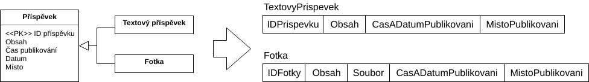
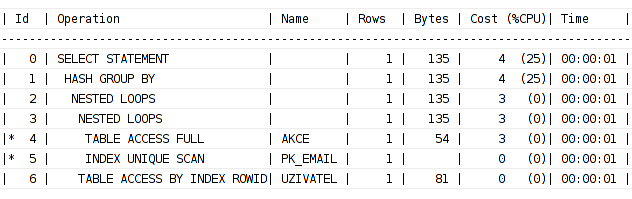
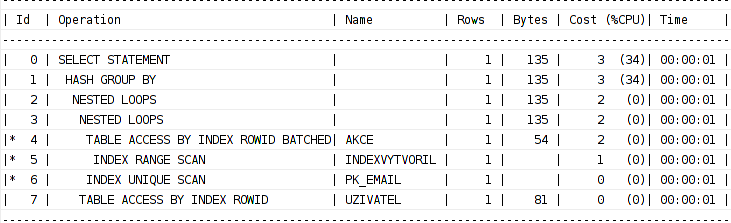

# IDS Dokumentace

**Téma:** Sociální síť

**Autoři:** 
* Attila Lakatos (xlakat01)
* Josef Adámek (xadame42)

## Převod vztahu generalizace/specializace

Pro převod vztahu generalizace/specializace jsme zvolili metodu převedení do dvou tabulek. Tento spůdob jsme zvolili, protože naše specializace jsou disjunktní a také jelikož entita Fotka má vztahy ještě s entitami Album a Akce, a musí do ní být uložen soubor (fotka), tak použitím dvou tabulek zamezíme vytváření prázdných míst.

## Triggery
Prvním triggerem vyplývajícím ze zadání projektu byl trigger na autoinkrementaci primárního klíče. Taktéž jsme vytvořili sekvenci kvůli uchování posledního čísla. Tato procedura byla aplikována na sloupec IDAkce z tabulky Akce.
Druhý trigger ověřoval, zda jsou čísla PSČ zadána ve správném tvaru. Trigger se spouští před ukládáním dat do tabulky.

## Procedury
Podle zadání projektu jsme vytvořili 2 procedury. V každé proceduře jsme použili kurzor, abychom byli schopní pracovat s řádky v databázi, a proměnnou s datovým typem odkazujícím na řádek tabulky.
První procedura vypíše počet akcí ve městě Brno a jeho procentuální vyjádření na dbms_output. Ošetřili jsme i případ dělení nulou, který může nastat tehdy, kdy informační systém neobsahuje žádné záznamy akcí. Hodnoty jsou zaokrouhlené na 2 desetinná místa.
Druhá procedura vypíše všechny uživatele, kteří zadali nesprávné kontaktní údaje a dále vypíše statistiku o kontaktních údajích. Náš systém umožňuje zadat různé kontaktní údaje, jako jsou například: telefonní číslo, email, webová stránka atd., a tato procedura detekuje nesprávně zadané hodnoty.

## EXPLAIN PLAN
Pomocí EXPLAIN PLAN získáme plán jak databáze zpracovává daný dotaz. Demonstrovali jsme na jednoduchém SELECT dotaze. Nejprve jsme spustili EXPLAIN PLAN bez použití indexů, následně jsme nadefinovali index a spustili jsme EXPLAIN PLAN znovu.

Výsledná tabulka bez použití indexů vypadá takto:

Výsledná tabulka s použitím indexů:

SELECT STATEMENT značí, že se uskutečnil SELECT dotaz. HASH GROUP BY znamená, že se shromážďuje podle hashovacího klíče, dále jsou zde 2x NESTED LOOPS, což znamená, že se spojily 2 tabulky (NATURAL JOIN).
Při používání EXPLAIN PLAN bez indexu máme TABLE ACCESS FULL, což znamená, že naše tabulka obsahuje malý počet řádků, v tomto případě prochází tabulka od začátku bez používání indexů.
V druhé tabulce se vykonával TABLE ACCESS BY INDEX ROWID BATCHED, který značí, že se přistupuje do tabulky přes konkrétní řádek (použil se náš index).
Díky tomu se snížila "cena", ale na druhé straně %CPU se zvětšilo. INDEX UNIQUE SCAN značí přístup k tabulkám přes B-strom.

## Přidělení práv
Druhý člen musí zadat SQL příkaz ALTER SESSION SET CURRENT_SCHEMA = první_člen_týmu, aby mohl pracovat s tabulkami.
Přidělení přístupových práv se realizuje pomocí:
* k tabulkám/materializovanému pohledu:  GRANT ALL ON tabulka/materializovaný_pohled TO druhý_člen_týmu
* k procedurám:                          GRANT EXECUTE ON procedura TO druhý_člen_týmu

## Materializovaný pohled
Nejprve bylo potřeba vytvořit materializované záznamy (tzv. logy) obsahující změny hlavní tabulky, které slouží na to, aby bylo možné používat rychlou obnovu po potvrzení změn, namísto kompletní obnovy, která by vyžadovala spouštět celý dotaz materializovaného pohledu, což by trvalo déle.
Kromě REFRESH FAST ON COMMIT jsme nastavovali i další vlastnost materializovaného pohledu: BUILD IMMEDIATE - po vytvoření se naplní hodnotami. Nakonec jsme k tomu přidali jednoduchý SELECT dotaz.
